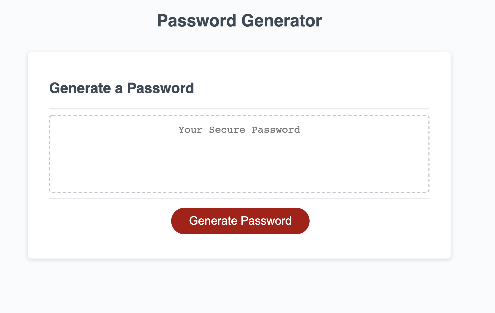

# homework-password-generator

This objective of this project is to create a password generator that will allow the user to select how many characters they would like.
The user may only choose 8 to 128 characters. The password will contain uppercase and lowercase letters, numbers and special characters.
The user will be prompted to input information once they press the generate password button.

(Github link:)[https://github.com/KeonaK/homework-password-generator]
(Github Deployment link: )[https://keonak.github.io/homework-password-generator/]

